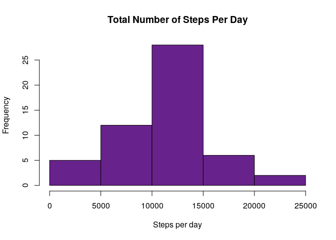
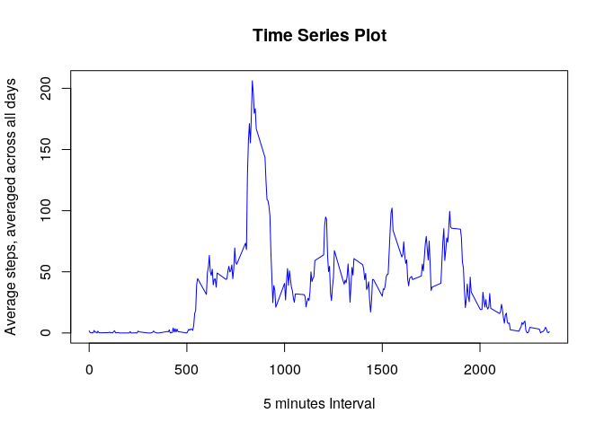
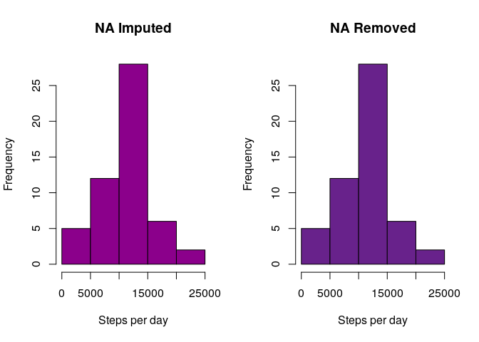
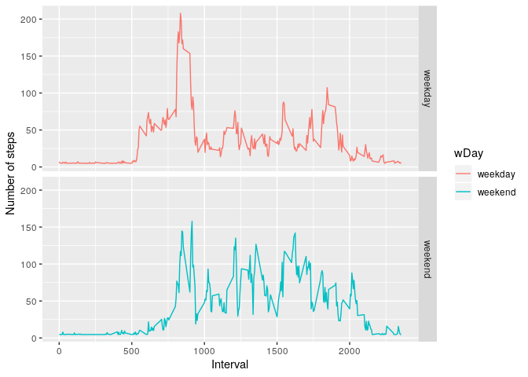

***
# Introduction

This is an assignment from week 2 of [The Reproducible Research][1] course offered by [Coursera][2]. 

This assignment makes use of data from a personal activity monitoring device. This device collects data at 5 minute intervals through out the day. The data consists of two months of data from an anonymous individual collected during the months of October and November, 2012 and include the number of steps taken in 5 minute intervals each day.

This work is done on RStudio for Linux. GitKraken for linux is used as a Git Client. This is written in R markdown and using knitr package a markdown and html file is created.

[1]: https://www.coursera.org/learn/reproducible-research
[2]: https://www.coursera.org
***

## Loading and preprocessing the data

It is necessary to first get the data. This can be easily done by forking/cloning [this repository][3]. 
Then, the working directory needs to be setup using setwd().

[3]: https://github.com/rdpeng/RepData_PeerAssessment1


```r
#Set up the working directory
```


```r
#Unzipping the zipped file

unzip("activity.zip")

#reading the csv file

data <- read.csv("activity.csv")
```

It is better to inspect the data before processing.


```r
head(data)
```

```
##   steps       date interval
## 1    NA 2012-10-01        0
## 2    NA 2012-10-01        5
## 3    NA 2012-10-01       10
## 4    NA 2012-10-01       15
## 5    NA 2012-10-01       20
## 6    NA 2012-10-01       25
```

```r
summary(data)
```

```
##      steps                date          interval     
##  Min.   :  0.00   2012-10-01:  288   Min.   :   0.0  
##  1st Qu.:  0.00   2012-10-02:  288   1st Qu.: 588.8  
##  Median :  0.00   2012-10-03:  288   Median :1177.5  
##  Mean   : 37.38   2012-10-04:  288   Mean   :1177.5  
##  3rd Qu.: 12.00   2012-10-05:  288   3rd Qu.:1766.2  
##  Max.   :806.00   2012-10-06:  288   Max.   :2355.0  
##  NA's   :2304     (Other)   :15840
```

```r
str(data)
```

```
## 'data.frame':	17568 obs. of  3 variables:
##  $ steps   : int  NA NA NA NA NA NA NA NA NA NA ...
##  $ date    : Factor w/ 61 levels "2012-10-01","2012-10-02",..: 1 1 1 1 1 1 1 1 1 1 ...
##  $ interval: int  0 5 10 15 20 25 30 35 40 45 ...
```

## What is mean total number of steps taken per day?


```r
totalsteps_day <- aggregate(steps ~ date, data, sum, na.rm = TRUE)

#First 10 rows
head(totalsteps_day, 10)
```

```
##          date steps
## 1  2012-10-02   126
## 2  2012-10-03 11352
## 3  2012-10-04 12116
## 4  2012-10-05 13294
## 5  2012-10-06 15420
## 6  2012-10-07 11015
## 7  2012-10-09 12811
## 8  2012-10-10  9900
## 9  2012-10-11 10304
## 10 2012-10-12 17382
```

### 1. Creating a Histogram


```r
hist(totalsteps_day$steps, main = "Total Number of Steps Per Day", ylab = "Frequency", xlab = "Steps per day", col ="darkorchid4")
```

<!-- -->

### 2. Mean and Median total number of steps per day


```r
# Calculating Mean
mean(totalsteps_day$steps)
```

```
## [1] 10766.19
```

```r
# Calculating Median
median(totalsteps_day$steps)
```

```
## [1] 10765
```

## What is the average daily activity pattern?

### 1. Making a time series plot (i.e. type = "l") of the 5-minute interval (x-axis) and the average number of steps taken, averaged across all days (y-axis)


```r
# Calculating average steps grouped by interval
average_steps <- aggregate(steps~interval, data, mean, na.rm=TRUE)

#Plotting the graph
plot(average_steps$interval, average_steps$steps, type = "l", col ="Blue", main = "Time Series Plot", xlab= "5 minutes Interval", ylab="Average steps, averaged across all days")
```

<!-- -->

### 2. Finding the maximum number of steps in the time series plot


```r
average_steps[which.max(average_steps$steps),]
```

```
##     interval    steps
## 104      835 206.1698
```

## Imputing missing values

### 1. Calculating the total number of missing values


```r
sum(is.na(data))
```

```
## [1] 2304
```

### 2. Devising a strategy for filling in all of the missing values in the dataset


```r
# Looking for missing value in each column
colSums(is.na(data))
```

```
##    steps     date interval 
##     2304        0        0
```

```r
# First 10 rows
head(data)
```

```
##   steps       date interval
## 1    NA 2012-10-01        0
## 2    NA 2012-10-01        5
## 3    NA 2012-10-01       10
## 4    NA 2012-10-01       15
## 5    NA 2012-10-01       20
## 6    NA 2012-10-01       25
```

Here, it can be seen that steps column has 2304 missing values/datas. This also corresponds to the toal number of missing values. Here, missing values for steps column is replaced by mean value of this column.

### 3. Creating a new dataset equal to original dataset without any missing value


```r
# Replacing the missing value with its mean
data1 <- data
data1$steps[is.na(data1$steps)] <- mean(data1$steps, na.rm = TRUE)

# New dataset
summary(data1)
```

```
##      steps                date          interval     
##  Min.   :  0.00   2012-10-01:  288   Min.   :   0.0  
##  1st Qu.:  0.00   2012-10-02:  288   1st Qu.: 588.8  
##  Median :  0.00   2012-10-03:  288   Median :1177.5  
##  Mean   : 37.38   2012-10-04:  288   Mean   :1177.5  
##  3rd Qu.: 37.38   2012-10-05:  288   3rd Qu.:1766.2  
##  Max.   :806.00   2012-10-06:  288   Max.   :2355.0  
##                   (Other)   :15840
```

```r
str(data1)
```

```
## 'data.frame':	17568 obs. of  3 variables:
##  $ steps   : num  37.4 37.4 37.4 37.4 37.4 ...
##  $ date    : Factor w/ 61 levels "2012-10-01","2012-10-02",..: 1 1 1 1 1 1 1 1 1 1 ...
##  $ interval: int  0 5 10 15 20 25 30 35 40 45 ...
```

```r
# Checking if there is any missing data
sum(is.na(data1))
```

```
## [1] 0
```

This shows that all the missing data is successfully filled/replaced. Also, the new dataset is equal to the original dataset.

### 4. New dataset: Creating a histogram, find mean & median, & comparing with original dataset.

#### 4.1 Creating a histogram of total number of steps taken each day for new dataset


```r
# Total number of steps taken each day
totalsteps_day1 <- aggregate(steps ~ date, data1, sum, na.rm = TRUE)

# Creating Histogram
hist(totalsteps_day$steps, main = "Total Number of Steps Per Day", ylab = "Frequency", xlab = "Steps per day", col ="darkmagenta")
```

<!-- -->

#### 4.2 Calculating mean & median


```r
# Calculating Mean
mean(totalsteps_day1$steps)
```

```
## [1] 10766.19
```

```r
# Calculating Median
median(totalsteps_day1$steps)
```

```
## [1] 10766.19
```

#### 4.3 Comparing both datasets

*Here, the totalsteps_day corresponds to original datasets in which NA is removed before calculation. And totalsteps_day1 corresponds to new datasets in which NA is imputed before calculation.*


```r
# comparing mean of both datasets
c(mean(totalsteps_day$steps), mean(totalsteps_day1$steps)) -> a
a
```

```
## [1] 10766.19 10766.19
```

```r
# comparing median of both datasets
c(median(totalsteps_day$steps),median(totalsteps_day1$steps)) -> b
b
```

```
## [1] 10765.00 10766.19
```

```r
# Creating a dataframe to compare mean & median of both datasets
data.frame("Datasets" = c("NA_Removed", "NA_Imputed"),"mean" = a, "median" = b)
```

```
##     Datasets     mean   median
## 1 NA_Removed 10766.19 10765.00
## 2 NA_Imputed 10766.19 10766.19
```

It is seen that mean for both datasets is similar and median is also somewhat similar. 


```r
# Comparing both histograms

#Creating histogram side by side
par(mfrow=c(1,2))

# Total Number of Steps Per Day (NA Imputed)
hist(totalsteps_day$steps, main = "NA Imputed", ylab = "Frequency", xlab = "Steps per day", col ="darkmagenta")

# Total Number of Steps Per Day (NA Removed)
hist(totalsteps_day$steps, main = "NA Removed", ylab = "Frequency", xlab = "Steps per day", col ="darkorchid4")
```

<!-- -->

It can be seen that the size and shape of the histograms in both cases is similar. Hence, it can be concluded that the removal or imputation of the missing values has no impact on the estimation of total number of steps per day.

## Are there differences in activity patterns between weekdays and weekends?

### 1. Creating a new factor variable in the dataset with two levels - Weekends and Weekdays

```r
# Defining Weekdays and Weekend
data1$date <- as.Date(data1$date)

weekdays1 <- c('Monday', 'Tuesday', 'Wednesday', 'Thursday', 'Friday')

data1$wDay <- c('weekend', 'weekday')[(weekdays(data1$date) %in% weekdays1)+1L]

# First 10 rows
head(data1, 10)
```

```
##      steps       date interval    wDay
## 1  37.3826 2012-10-01        0 weekday
## 2  37.3826 2012-10-01        5 weekday
## 3  37.3826 2012-10-01       10 weekday
## 4  37.3826 2012-10-01       15 weekday
## 5  37.3826 2012-10-01       20 weekday
## 6  37.3826 2012-10-01       25 weekday
## 7  37.3826 2012-10-01       30 weekday
## 8  37.3826 2012-10-01       35 weekday
## 9  37.3826 2012-10-01       40 weekday
## 10 37.3826 2012-10-01       45 weekday
```

### 2. Creating a panel plot containing time series plot of 5 min Interval (x-axis) vs Average Number of steps (y-axis), averaged across all week


```r
# Average number of steps averaged across all weekend and weekdays
average_steps1 <- aggregate(steps ~ interval + wDay, data1, mean)

# Creating the plot
library(ggplot2)
qplot(average_steps1$interval, average_steps1$steps, 
      geom = "line", 
      xlab= "Interval", ylab = "Number of steps", 
      data=average_steps1, 
      col= wDay, 
      facets = wDay~.)
```

<!-- -->
